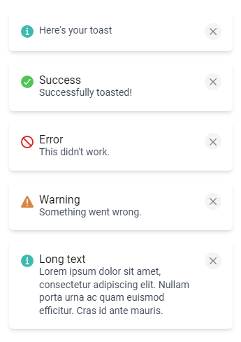

<p align="center">


</p>

<h3 align="center">
   <a href="https://svelte.dev/repl/46c3c3c8943e4752a380ce019fb99739?version=3.49.0" >
 REPL
  </a>
</h3>

## ✨ Features

- 👌 Zero-dependency
- 🪶 Lightweight
- ✏️ Custom components
- 🎨 Easily themable
- 📱 Mobile friendly

## 📸 Screenshots



## ☀️ License

[MIT](./LICENSE)

## 📦 Installation

```
$ npm install svelte-cool-toast
```

## 🔨 Usage

Wrap your app with the `ToastProvider` component and then use the `toast` helper to create a new notification.

```Svelte
<script>
  import { ToastProvider, toast } from 'svelte-cool-toast';
  import "svelte-cool-toast/css/theme.css";
</script>

<ToastProvider>
  <button
    on:click={() => {
      toast('Successfully toasted!', {
        title: 'Title',
        duration: 5000,
        type: 'success'
      });
    }}
  >
    Make me a toast
  </button>
</ToastProvider>

```

## 🍱 Custom components

If you want to render a custom content component simply pass the `contentComponent` prop to the `ToastProvider`.

```Svelte
// MyContentComponent.svelte

<script lang="ts">
  import type { ToastType } from 'svelte-cool-toast';

  export let title = '';
  export let message = '';
  export let type: ToastType = 'normal';
</script>

<div>
  <h3>{title}</h3>
  <p>{type}</p>
  <p>{message}</p>
</div>

```

```Svelte
// App.svelte

<script>
  import { ToastProvider, toast } from 'svelte-cool-toast';
  import "svelte-cool-toast/css/theme.css";

  import MyContentComponent from './MyContentComponent.svelte';
</script>

<ToastProvider contentComponent={MyContentComponent}>
  <button
    on:click={() => {
      toast("Here's your toast");
    }}
  >
    Make me a toast
  </button>
</ToastProvider>

```

Similarly if you wan't to change the default dismiss button you can pass your own `dismissComponent` prop to the `ToastProvider`.

```Svelte
// MyDismissButton.svelte

<div>
  <p>Close</p>
</div>

```

```Svelte
// App.svelte

<script>
  import { ToastProvider, toast } from 'svelte-cool-toast';
  import "svelte-cool-toast/css/theme.css";

  import MyDismissButton from './MyDismissButton.svelte';
</script>

<ToastProvider dismissComponent={MyDismissButton}>
  <button
    on:click={() => {
      toast("Here's your toast");
    }}
  >
    Make me a toast
  </button>
</ToastProvider>
```

## 🎨 Theming

You can use your own styles for the toast container by targeting the `.toast-conatiner` class.

```Svelte
// App.svelte

<script>
  import { ToastProvider, toast } from 'svelte-cool-toast';
</script>

<ToastProvider>
  <button
    on:click={() => {
      toast("Here's your toast");
    }}
  >
    Make me a toast
  </button>
</ToastProvider>

<style global>
  .toast-container {
    background-color: #9aeda7;
  }
</style>

```
